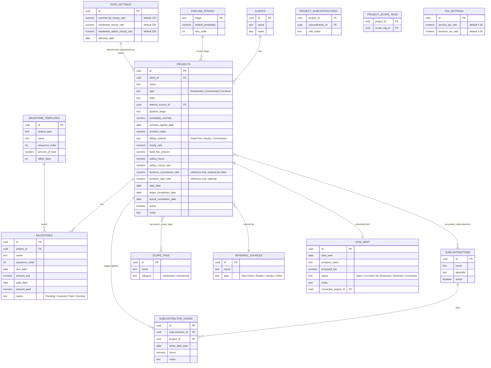

# Data Model — Below the Trusses

Target: Postgres via Supabase. Table names in `snake_case`. All tables get `id uuid primary key
default gen_random_uuid()`, `created_at timestamptz default now()`, `updated_at timestamptz
default now()` unless noted.

## Entity-Relationship Overview

## Table Definitions

### `clients`
| Column | Type | Notes |
|---|---|---|
| id | uuid | PK |
| name | text | required |
| notes | text | |

A client can have multiple projects over time (e.g., "Dantzler" family referring multiple
sub-clients — those become separate `clients` rows linked via `referral_source_id`, not nested
under one client).

### `projects`
| Column | Type | Notes |
|---|---|---|
| id | uuid | PK |
| client_id | uuid FK → clients | required |
| name | text | display name, e.g. "Azar_Kennesaw/Acworth" |
| type | text enum | `Residential`, `Commercial`, `Furniture` |
| state | text | 2-letter US state code, nullable until captured |
| referral_source_id | uuid FK → referral_sources | nullable |
| pipeline_stage | text FK → pipeline_stages.stage | `Lead`, `SOW Sent`, `Verbal`, `Signed`, `Lost` |
| probability_override | numeric | nullable — overrides the stage's default probability for this project |
| contract_signed_date | date | nullable — null until stage = Signed |
| contract_value | numeric | total committed value |
| start_date | date | nullable, editable post-intake |
| target_completion_date | date | nullable, editable post-intake |
| actual_completion_date | date | nullable |
| billing_method | text enum | `Fixed Fee`, `Hourly`, `Commission` — see Billing Structure below |
| hourly_rate | numeric | nullable, snapshotted from `rate_settings` at intake (Commercial and Hourly-billed Residential) |
| fixed_fee_amount | numeric | nullable, Residential Fixed Fee jobs |
| addon_hours | numeric | nullable, hours billed beyond the originally contracted scope (Residential) |
| addon_hourly_rate | numeric | nullable, snapshotted from `rate_settings` at intake, default $200/hr |
| furniture_commission_rate | numeric | nullable, **reference only** — entered/confirmed per deal, varies (~30% typical), never defaulted silently and never used to calculate revenue |
| furniture_sale_total | numeric | nullable, **reference only** — gross sale amount if known; not used in any revenue or tax calculation |
| active | boolean | mirrors the old "Active" Yes/No flag |
| notes | text | |

Committed/forecast views filter on `contract_signed_date` + `contract_value`.
Collected/cash views aggregate from `milestones.amount_paid` / `paid_date`.

### Billing Structure

Three billing methods, one per project type as the default (owner can override if a residential
job runs hourly instead of fixed, etc.):

| Type | Default method | How `contract_value` is derived |
|---|---|---|
| Commercial | Hourly | `hourly_rate` (default $120) × estimated/actual hours — hours are not tracked in v1 beyond the estimate entered at intake; Phase 4's `subcontractor_hours` table is a separate concept (sub cost, not client billing) and should not be conflated with billable hours unless the owner wants that later |
| Residential | Fixed Fee (most common) or Hourly | Fixed: `fixed_fee_amount` + (`addon_hours` × `addon_hourly_rate`, default $200/hr, for any work requested beyond the original contracted scope). Hourly: `hourly_rate` (default $200) × estimated/actual hours |
| Furniture | Commission | **Entered directly, no calculation.** The dollar amount recorded for a Furniture-type entry (via milestones, same as any other type) *is* the commission Below the Trusses was actually paid — not a gross sale figure requiring a percentage applied. `furniture_commission_rate` and `furniture_sale_total` are optional reference fields only, for the owner's own records, and must never feed into revenue or tax totals. |

`rate_settings` holds the current defaults (one row, or versioned by `effective_date` if rates
change over time and historical projects need to keep the rate that applied when they were
signed). Values are **snapshotted onto the project at intake**, not looked up live, so a later
rate change doesn't silently alter historical/committed projects. Note that `rate_settings` does
**not** include a furniture commission default — that rate is negotiated per deal and must always
be entered/confirmed explicitly, never pre-filled.

### `milestones`
Billing/payment events. Monthly "revenue collected" figures are `sum(amount_paid)` grouped by
`date_trunc('month', paid_date)`.

| Column | Type | Notes |
|---|---|---|
| project_id | uuid FK | |
| name | text | e.g. "Deposit", "Design Development", "Install", "Final Payment" |
| sequence_order | int | |
| due_date | date | |
| amount_due | numeric | |
| paid_date | date | nullable until paid |
| amount_paid | numeric | nullable, can differ from amount_due (partial payment) |
| status | text enum | `Pending`, `Invoiced`, `Paid`, `Overdue` |

### `milestone_templates`
Seed data for auto-populating milestones at intake, editable per project after creation.

| project_type | name | sequence_order | percent_of_total | offset_days |
|---|---|---|---|---|
| Residential | Deposit | 1 | 30% | 0 |
| Residential | Design Development | 2 | 30% | 30 |
| Residential | Construction Documents | 3 | 20% | 60 |
| Residential | Final / Install | 4 | 20% | 90 |
| Furniture | Payment | 1 | 100% | 0 |
| Commercial | *(none seeded — fully custom for now)* | — | — | — |

> Percentages and offsets above are placeholders — confirm actual standard sequence with the
> owner before seeding; the schema supports whatever the real breakdown turns out to be.

### `subcontractors`
| name | specialty |
|---|---|
| Mariano Oliveti | Commercial projects |
| Rachel Roberts | Plans and finishes |
| Lee Mccoy | Plans and renderings |
| Rusty Ragsdale | Architect |

### `project_subcontractors` (join table)
`project_id`, `subcontractor_id`, `role_notes` (optional free text, e.g. "lead architect").

### `subcontractor_hours` (Phase 2+)
Weekly hour logs: `subcontractor_id`, `project_id`, `week_start_date`, `hours`, `notes`.

### `scope_tags` / `project_scope_tags`
Many-to-many, **with a dollar amount on the join table** — a project can span several scope
areas, each contributing its own portion of the project's value, not just a label.

`project_scope_tags`: `project_id`, `scope_tag_id`, `amount` (numeric, nullable — fill in as
known; doesn't need to reconcile exactly to `contract_value`, but should be close once a project
is fully scoped).

**Scope applies to Residential projects only** (confirmed with owner — Commercial and Furniture
don't use this breakdown). Seed `scope_tags` with (`category = 'residential'`):

- Furniture and Accessories
- Covered Porch
- Sunroom
- Backyard Design
- Kitchen Remodel
- Bathroom Remodel
- Exterior Finishes
- Interior Finishes

> Note: "Furniture and Accessories" here is a **scope category within a residential project**
> (e.g., a furniture package included as part of a remodel's fixed fee) — this is distinct from
> the `Furniture` project **type**, which is the separate commission-based resale business line.
> Don't conflate the two: a Residential project can have a "Furniture and Accessories" scope
> amount without being a `Furniture`-type project at all.

### `referral_sources`
| name | type |
|---|---|
| Dantzler | Past Client |
| Cyr | Past Client |
| Garnet | Past Client |
| Realtor (Rose Lickenbrock) | Realtor |
| Generation Homes | Vendor |
| ... | ... |

Seed from the parenthetical names already in the Excel file (see migration mapping below), then
use this table going forward instead of naming convention.

### `sow_sent`
| Column | Type | Notes |
|---|---|---|
| date_sent | date | |
| prospect_name | text | |
| proposed_fee | numeric | nullable |
| status | text enum | `Open`, `On Hold`, `No Response`, `Declined`, `Converted` |
| notes | text | |
| converted_project_id | uuid FK → projects | nullable, set when a proposal converts |

### `pipeline_stages`
Lookup/config table so probability weights are editable without a schema change:

| stage | default_probability | sort_order |
|---|---|---|
| Lead | 0.10 | 1 |
| SOW Sent | 0.25 | 2 |
| Verbal | 0.60 | 3 |
| Signed | 1.00 | 4 |
| Lost | 0.00 | 5 |

### `tax_settings`
Single-row config table: `service_tax_rate` (default 0.30), `furniture_tax_rate` (default 0.00).
Keeping this as data (not hardcoded) means a future rate change doesn't require a code deploy.

### `users`
Handled by Supabase Auth (`auth.users`). Add a thin `profiles` table (`id` = auth user id, `full_name`,
`role` enum `owner | staff | subcontractor`) for role-based UI/permissions.

---

## Migration Mapping — Excel → New Schema

| Excel source | New location |
|---|---|
| `INPUT` sheet, one row per client/engagement | Splits into one `clients` row (deduped by name) + one `projects` row per distinct engagement |
| `Type` column | `projects.type` |
| `Active` (Yes/No) | `projects.active` |
| Monthly $ columns (Jan-24 … Dec-26) | Becomes `milestones` rows: one milestone per non-empty month, `paid_date` = that month, `amount_paid` = the value, `status = 'Paid'`. This preserves the cash-collected history exactly. Going forward, real milestones (not one-per-month) should be used. |
| Client names with `(Name)` in parentheses | Parsed once into `referral_sources`, then `projects.referral_source_id` set on the referred project — retire the naming convention after migration |
| `SOW Sent` sheet | Maps directly to `sow_sent` table (`DATE` → `date_sent`, `NAME` → `prospect_name`, `FEE` → `proposed_fee`, `NOTES` → `notes`, status inferred from notes text where possible, otherwise `Open`) |
| `Sheet1` (Status column: Invoiced/Forecast/Pipeline estimate) | Informs initial `pipeline_stage` assignment during backfill, not carried forward as a live field |
| No existing column | `state`, scope tags, subcontractor links, contract_signed_date, start/target/actual completion dates — all null on migrated rows, to be backfilled or captured going forward |

**Import approach**: build the import as an idempotent script keyed on a stable natural key
(e.g., `client name + project name`), so the owner can re-run it as the cleaned-up Excel data
evolves without creating duplicates or wiping manually-entered detail (scope tags, subcontractors,
etc.) that was added after a prior import.
